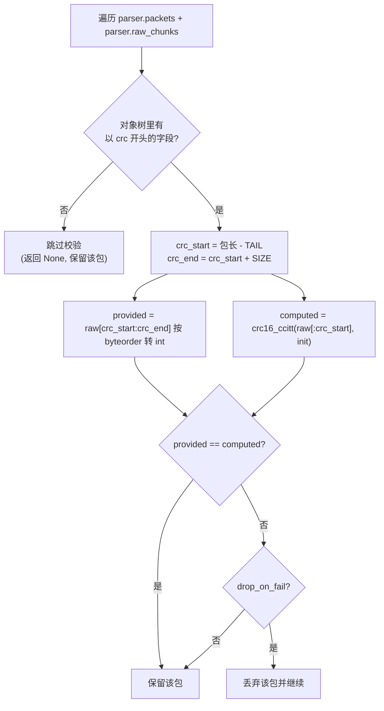

# AUTO PARSER 工程手册

> 面向本仓库维护者与使用者的实践手册：从 `.ksy` 语法语义，到编译、解析、CRC 校验、取值与落盘。
> 本手册位于 `doc/`；配套文件：根目录 `README.md`（快速入门）、`CHANGELOG.md`（版本日志）、
> `doc/kaitai struct说明.md`（Kaitai 语法详解与踩坑）、`doc/crc_reference.md`（CRC 参考实现与标准校验值）、
> `ksy/README.md`（包定义版本矩阵）、`test/README.md`（测试说明）。
> **对外接口契约见 §12 API 协定**。

---

## 1. 它是什么

基于 [Kaitai Struct](https://kaitai.io) 的**配置化二进制包解析工具**。核心链路只有一个：


三段的职责边界（这是本项目最重要的设计约定，详见 `doc/kaitai struct说明.md` §8）：

| 阶段 | 承担者 | 做什么 | 不做什么 |
|---|---|---|---|
| parse | Kaitai 生成解析器 | 从字节流按格式描述提取字段、校验魔数/范围 | 不做 CRC/哈希等算法校验 |
| validate | `src/validator.py` | CRC16、奇偶/异或、丢弃坏包 | 不关心字段语义 |
| write | `src/writer.py` | 落盘 CSV/JSON/Parquet | 不感知 Parser/Validator |

**KSY 是纯解析器、语言中立**：它不认识 Python 的 `zlib.crc32` 或你写的 `calc_crc`，所以 `value: calc_crc(payload)` 这类写法非法。CRC 必须放在应用层。

---

## 2. 快速上手

```powershell
# 1) 安装依赖
pip install -r requirement.txt          # kaitai-struct-compiler>=0.11 / kaitaistruct>=0.11 / tabulate

# 2) 编译 ksy/ 下所有 .ksy -> generated/
python scripts/compile_ksy.py           # 或：终端 -> 运行生成任务 -> 编译 Kaitai 解析器

# 3) 解析并输出（默认源文件就是 test/sample.hk：唯一纳入版本管理的真实样本）
python main.py --src .\test\sample.hk --des .\out
# 产物：out/sample_packets.csv、out/sample_packets.json

# 4) 跑测试（可选；改完 ksy / 解析逻辑后建议都跑一次）
python -m pytest test -q
```

命令行要点：

- `-s/--src` 源文件，`-d/--des` 输出目录，`--out-type csv,json,parquet` 覆盖 conf 默认输出格式。
- 输出格式以 `conf/conf.json` 的 `OUTPUT_TYPE`（数组）为默认；置 `[]` 表示**只解析不写文件**。
- 同一扩展名匹配到多个解析器时会弹出菜单选择，输入 `-1` 退出。
  例：`.hk` 有 3 个版本（187B 的 `grid1x_hk_parser` / 178B 的 `grid1x_hk_178_parser` /
  187B 的 `grid10b_hk_parser`），解析 `test/sample.hk` 请选 **178B** 那条。
- 解析器注册表在 `conf/conf.json` 的 `PARSER` 数组：`NAME/TYPE/MODULE/CLASS/PACKET_LEN/DESCRIPTION/VERSION`。

---

## 3. 目录与职责

| 路径 | 职责 |
|---|---|
| `ksy/` | **唯一真源**包定义（`.ksy`），按**版本**分组：`grid1x/`（1x 各包）、`grid11b/`、`grid10b/`、`misc/`；`_drafts/` 为历史草稿，**不参与编译** |
| `generated/` | 编译产物（镜像 `ksy/` 子目录，含 `__init__.py`），**勿手改** |
| `grid_parser_ref/` | 旧解析实现 + 参考 XML（`grid_packet.xml` / `yingtian_packet.xml`），**仅作版本对照**，不参与流程 |
| `conf/conf.json` | 解析器注册表（`PARSER`）+ 默认输出格式（`OUTPUT_TYPE`）+ CRC 算法表（`CRC_ALGO`） |
| `src/parser.py` | 切片解析、字段提取、基础类型转换 |
| `src/validator.py` | 语义校验（CRC16/CCITT），输出可写记录 |
| `src/writer.py` | CSV / JSON / Parquet 落盘 |
| `src/pipeline.py` | 串起 Parser → Validator → Writer |
| `main.py` | 薄 CLI：参数/配置/解析器选择，交给 Pipeline |
| `scripts/compile_ksy.py` | 一键编译 `ksy/**/*.ksy`（跳过 `_drafts/` 与 `*_draft.ksy`，支持 `--out`） |
| `test/` | **pytest 测试**（`python -m pytest test -q`）+ 唯一真实样本 `test/sample.hk`（517×178B）；说明见 `test/README.md` |
| `script/` | 开发辅助脚本：`verify_e2e.py` / `verify_equiv.py` / `verify_ksy_drafts.py` / `compare_generated.py`；`script/_once/` 为一次性工具 |
| `doc/` | 文档目录：本手册、`kaitai struct说明.md`、`crc_reference.md`、`housekeepping_data_format.md`、`yingtian_pkt.txt`、`test.ipynb`（历史草稿） |
| `in/` / `out/` | 待解析输入 / 解析产物；两者除 `.gitkeep` 外都不入库 |
| `xml/grid_packet.xml` | 原始包定义存档 |

> `ksy/` 下所有非草稿定义都已在 `conf.json` 注册；同一扩展名有多个版本时（`.hk` × 3、`.ft` × 2）
> 由 CLI 菜单区分（`test/test_registry.py` 会检查“布局表 ↔ conf ↔ generated”三者不脱节）。

---

## 4. KSY 语法与语义（够用版）

`.ksy` 由四段构成：`meta`（元信息）→ `seq`（顺序字段）→ `types`（自定义类型）→ `instances`（惰性字段）。
`enums` 是与它们平级的顶层段。

### 4.1 meta

```yaml
meta:
  id: grid10b_tel_packet  # 生成的类名（PascalCase）与模块名（snake_case）
  endian: be            # 字节序：be 大端 / le 小端，多字节字段必须匹配
  file-extension: tlm   # 可选：目标扩展名
doc: 天格遥测数据包        # 包级 doc 必须放【根级】，写进 meta 会报 unknown key
```

> `.ksy` 只管“怎么切字节”，**不承担任何校验职责**：不写 `ks-debug`，也不声明 CRC 位置。
> 是否需要 CRC 校验、CRC 在第几字节，全部由解析参数（conf / `Validator(...)`）给出，见 §7。

### 4.2 字段类型

| 类别 | 关键字 | 说明 |
|---|---|---|
| 整数 | `u1..u8` / `s1..s8` | 数字后缀即字节数；有符号用 `s` |
| 浮点 | `f4` / `f8` | IEEE 754 |
| 字节串 | `bytes` | 需配 `size:` |
| 字符串 | `str` / `strz` | 需配 `encoding:` |
| 自定义 | `type: <类型名>` | 引用 `types:` 中的类型 |
| 参数化 | `type: scaled(0.1, 0.0)` | 引用带 `params` 的类型（见 §4.5） |

### 4.3 重复

- `repeat: eos` —— 读到流末尾（不定长帧序列）；
- `repeat: expr` + `repeat-expr: N` —— 固定 N 次；
- `repeat: until` + `repeat-until: 条件` —— 满足条件即停。

### 4.4 校验：`valid` vs `contents`

| | `contents` | `valid` |
|---|---|---|
| 目标 | 原始字节固定序列（魔数） | 已解析的值（整数/枚举/字符串） |
| 写法 | `contents: [0x47,0x52,0x49,0x44]` | `valid: val == 0x1234` 或 `valid: {eq: 0x1234}` |
| 时机 | 解析该字段时即时逐字节比较 | 字段解析完成后条件检查 |
| 适用 | 固定帧头/帧尾 | 取值范围、枚举、跨字段、动态校验 |

> ⚠️ `contents` 与 `type` **不能同时写**（`- id: header` + `contents: [...]` 即可，字段类型是 `bytes`）。
> CRC 这类"动态校验"**不要**塞进 `valid`，交给 Validator。

### 4.5 单位换算：`type` + `instances`（本项目 `tel.ksy` 用法）

标量类型不能挂算术换算，但可以用**参数化自定义类型**把"读原始值 + 换算"封装成一个可复用单位：

```yaml
types:
  scaled:
    params:
      - id: scale
        type: f8
      - id: offset
        type: f8
    seq:
      - id: raw            # 原始值（按协议单位）
        type: u2
    instances:
      converted:           # 惰性派生值（换算后）
        value: raw * scale + offset

seq:
  - id: system_power
    type: scaled(0.1, 0.0)     # 位置参数，按 params 顺序对应：0.1W -> W
  - id: sipm_temperature_ch0
    type: scaled(0.01, -273.15)  # 10mK -> 摄氏度
```

访问方式：`f.system_power.raw`（原始）、`f.system_power.converted`（换算）。
**raw 与 converted 同时保留**，二进制结构可回放，下游也能直接拿物理量。

> 关键区分：`process`（xor/zlib 等）操作的是**字节**；`instances.value` 操作的是**已解析的数值**。
> 开氏度→摄氏度、ADC→电压这类换算属于后者，不能写进 `process`。

### 4.6 枚举

```yaml
enums:
  normal_or_backup:
    1: master_flash
    2: backup_flash
seq:
  - id: normal_or_backup
    type: u1
    enum: normal_or_backup
```

生成代码用 `IntEnum` + `KaitaiStream.resolve_enum` 绑定。注意：`print(f.normal_or_backup)` 在某些 Python
版本会显示整数（`IntEnum.__str__` 行为），但值本身就是枚举成员：

```python
from grid10b.grid10b_tel_packet import Grid10bTelPacket
item = f.normal_or_backup
print(item.name, item.value)              # backup_flash 2
print(Grid10bTelPacket.NormalOrBackup(2).name)  # backup_flash
```

### 4.7 instances（惰性字段）

| 类型 | 关键字 | 特点 |
|---|---|---|
| 值实例 | `value:` | 纯表达式计算，不消耗字节（如 `converted`） |
| IO 实例 | `pos:`/`size:` + `type:` | 从指定偏移取字节/子结构（如 `body_data` 取整帧原始字节） |

instances 只在**首次访问**时求值并缓存；生成代码里是 `@property`，因此 `vars(obj)` 里看不到它们
（`Parser._member_names` 已专门处理，见 §6.3）。

### 4.8 语法陷阱速查

| 现象 | 原因 / 解决 |
|---|---|
| `mapping values are not allowed here` | `doc` 值含 **ASCII 冒号+空格**（`单位: cps`）-> 加引号 `doc: "..."` |
| `unknown key found ... expected: application,...` | 包级 `doc` 误写在 `meta` 下 -> 移到根级 |
| `unknown key found ... expected: consume, doc,...` | `type` 与 `contents` 同时写 -> 去掉 `type` |
| 字段名报错 | Kaitai 标识符必须全小写 `^[a-z][a-z0-9_]*$` |
| 数字长度对不上 | 检查 `endian`、`repeat-expr`、以及是否把 `u1` 误写成 `u8` |

---

## 5. 编译

### 5.1 批量编译（生产推荐）

```powershell
python scripts/compile_ksy.py     # ksy/**/*.ksy -> generated/（镜像子目录，自动生成 __init__.py）
```

脚本内部对每个 `.ksy` 执行：

```powershell
kaitai-struct-compiler -t python -d <out_dir> <file.ksy>
```

### 5.2 手动编译单个文件 / 编译到临时目录

`compile_ksy.py` 扫描 `ksy/`（跳过 `_drafts/` 与 `*_draft.ksy`），并支持 `--out` 指定输出目录
（便于做“迁移前后”对比而**不覆盖** `generated/`）：

```powershell
python scripts/compile_ksy.py --out .\tmp\generated_check                    # 只编译到临时目录
kaitai-struct-compiler -t python -d .\generated .\ksy\grid1x\grid1x_wf_packet.ksy   # 单文件
# 生成 generated/grid10b/grid10b_tel_packet.py（模块名 = meta.id），类名 Grid10bTelPacket
```

### 5.3 调试信息（可选，与校验无关）

**CRC 校验不再依赖调试信息**：`.ksy` 不写 `ks-debug`，CRC 的启用与定位全部由解析参数决定（见 §7）。

`--debug` 仅作为排查手段保留（可查看字段字节偏移）：

```powershell
kaitai-struct-compiler -t python --debug -d .\generated .\ksy\grid10b\grid10b_tel_packet.ksy
```

> ⚠️ **调试模式的重要差异**：`--debug` 生成的类，`__init__` **不会**自动调用 `_read()`（普通模式会自动调用）。
> 直接 `Obj(KaitaiStream(...))` 会解析出空对象。本仓库的 `Parser._construct()` 已自动兼容两种模式；
> 若你自己手写调用，调试模式需显式补一次 `obj._read()`。

---

## 6. 用 Python 获取与处理结果

### 6.1 方式 A：Pipeline（最省心，推荐）

```python
from src.pipeline import Pipeline

entry = {"NAME": "tel10b", "MODULE": "grid10b.grid10b_tel_packet",
         "CLASS": "Grid10bTelPacket", "PACKET_LEN": 88}
result = Pipeline(entry, r".\in\demo.tel", r".\out", output_type=["json"]).run()

# result:
# {
#   "packet_len": 88,      # 单包字节数（0 = 变长）
#   "count": 2,            # 解析出的包数
#   "unparsed": 0,         # 因帧头/帧尾/contents 校验失败被跳过的包数
#   "valid": 2,            # 通过校验、实际写出的记录数
#   "dropped": 0,          # 因 CRC 失败被丢弃的包数
#   "checked": 0,          # 实际参与 CRC 校验的包数（0 = 跳过）
#   "trailing": 0,         # 末尾未对齐字节数
#   "paths": {"json": r".\out\sample_packets.json"},
# }
```

### 6.2 方式 B：直接用 Parser / Validator（需要中间对象时）

```python
from src.parser import Parser
from src.validator import Validator

parser = Parser(entry, r".\in\demo.tel")
parser.packets     # 原始 Kaitai 对象列表（字段是属性，可点号访问）
parser.fields      # 顶层字段名（含惰性 instances 名）
parser.raw_chunks  # 与 packets 一一对应的原始字节切片
parser.unparsed    # 定长切片中因帧头/帧尾/contents 校验失败被跳过的包数
parser.to_records()# 不经校验的 [{字段: 基础值}]

validator = Validator(parser, crc=True, drop_on_fail=True)
records = validator.process()   # 通过校验的记录（校验失败已丢弃）
validator.dropped               # 丢弃数
validator.checked               # 参与校验的包数
```

### 6.3 方式 C：直接用生成的 Kaitai 类（无需 Parser）

```python
import sys; sys.path.insert(0, r".\generated")
from kaitaistruct import KaitaiStream, BytesIO
from grid10b.grid10b_tel_packet import Grid10bTelPacket

data = open(r".\in\demo.tel", "rb").read()
obj = Grid10bTelPacket(KaitaiStream(BytesIO(data[:88])))
obj._read()            # 调试模式需要；普通模式可省略（构造时已读）
# 单包写法：字段直接在 obj 上（旧的 frameseq 写法才是 obj.frames[0]）
```

### 6.4 提取原始值与转换值（三种层级的写法）

```python
# ① 直接属性：最常用，raw / converted 都在
frame = parser.packets[0]
frame.system_power.raw          # 100      （协议原始值，单位 0.1W）
frame.system_power.converted    # 10.0     （换算值，单位 W）

# ② 转成 dict 记录（Pipeline / Validator 的产物）：
#    参数化类型被展开成 {"raw":..., "converted":...}
records[0]["frames"][0]["system_power"]
# -> {'raw': 100, 'converted': 10.0}

# ③ 惰性原始字节实例（如 body_data）会被转成十六进制字符串
frame.body_data                 # list[int]（原始字节）
records[0]["frames"][0]["body_data"]   # '47524944...' （hex 字符串）
```

> `Parser.to_records()` / `Validator.process()` 会**同时**输出 seq 字段与 instances：
> - seq 字段含原始整数值；
> - 参数化类型的 `converted` 作为派生值一并输出；
> - `body_data` 这类字节实例转为 hex 字符串（JSON/CSV/Parquet 均可承载）。

### 6.5 遥测包（`ksy/grid10b/grid10b_tel_packet.ksy`）的单位换算矩阵

| 字段 | raw 单位 | `scaled(scale, offset)` | converted 单位 |
|---|---|---|---|
| `system_power` | 0.1 W | `(0.1, 0.0)` | W |
| `system_input_voltage` | 0.01 V | `(0.01, 0.0)` | V |
| `sipm_voltage_ch0..3` | mV | `(0.001, 0.0)` | V |
| `sipm_current_ch0..3` | uA | `(0.001, 0.0)` | mA |
| `sipm_temperature_ch0..3` | 10 mK | `(0.01, -273.15)` | 摄氏度 |

枚举字段：`file_upload_check`、`normal_or_backup`、`sample_mode`、`saa_status`、`sipm_hot_flag`。

### 6.6 落盘细节（Writer）

```python
from src.writer import Writer
Writer.SUPPORTED          # ('csv', 'json', 'parquet')
Writer(records, des, stem, type=["csv", "json", "parquet"]).write()
```

- CSV：`utf-8-sig`（Excel 友好），**嵌套 dict/list 会以 Python repr 文本写入**（扁平字段最友好）；
- JSON：`ensure_ascii=False, indent=2`，保留嵌套结构；
- Parquet：依赖 `pyarrow`，`Table.from_pylist` 自动推断 schema，支持嵌套 struct/list（数据分析首选）。

> 需要"扁平、可分析"的表，建议在应用侧把嵌套字段拍平（如 `frames.0.system_power.converted`）后再交给 Writer。

---

## 7. CRC16 校验

### 7.1 算法与参数

本仓库实现 `src/validator.py::crc16_ccitt`：

```python
def crc16_ccitt(data: bytes, init: int = 0) -> int:
    crc = init & 0xFFFF
    for b in data:
        crc ^= (b << 8) & 0xFFFF
        for _ in range(8):
            if crc & 0x8000:
                crc = ((crc << 1) ^ 0x1021) & 0xFFFF
            else:
                crc = (crc << 1) & 0xFFFF
    return crc
```

- 多项式 `0x1021`，MSB-first，无反射、无最终异或；
- `init=0x0000` 时即 **CRC-16/XMODEM**；`init=0xFFFF` 时即 **CRC-16/CCITT-FALSE**；
- 存储 CRC 的读取字节序由 `byteorder` 控制（本项目协议多为大端 `big`）。

### 7.2 Validator 如何工作



- **是否校验 / 用哪个算法**：**完全不看 PARSER**。显式指定（`crc_func` / `crc_algo` / CLI `--crc-algo`）时用指定算法；
  否则若 ksy 声明了 `crc_algo` 就用它；再否则按源文件后缀在 conf 顶层 `CRC_ALGO` 各算法的 `SUPPORT` 里匹配；
  都没命中则跳过（`checked` 不增加）；
- **位置/范围**：优先取 ksy `instances` 里的元数据（见 §7.8），没有才用算法条目 / SUPPORT 里的 `TAIL`/`SIZE`：
  `crc_start = 包长 - TAIL`、`crc_end = crc_start + SIZE`，计算区间 = `[skip0, crc_start - skip1)`；
  CRC 后面还有帧尾/填充时需加大 `TAIL`（grid1x：FT = 6、ES = 6、WF = 6，均为 crc 2 + 帧尾 4）；
- **无 crc 字段且 ksy 无元数据**：自动跳过（`checked` 不增加），不影响正常解析。

### 7.3 在 conf 中配置

CRC 配置**只写在顶层 `CRC_ALGO`**：算法表 + 各算法默认适用的格式（`SUPPORT`）；PARSER 条目里不出现任何 CRC 字段。

```json
// 顶层：算法表（各算法 + 默认适用于哪些格式）
"CRC_ALGO": [
    { "NAME": "crc16_ccitt", "MODULE": "src.checks.crc16_ccitt", "FUNC": "crc16_ccitt",
      "SIZE": 2, "INIT": "0x0000", "BYTEORDER": "big", "TAIL": 2, "DROP_ON_FAIL": true,
      "SUPPORT": [ { "TYPE": ".hk" },
                   { "TYPE": ".ft", "TAIL": 6 },
                   { "TYPE": ".wf", "TAIL": 6 },
                   { "TYPE": ".es", "TAIL": 6 } ],
      "DESCRIPTION": "..." },
    { "NAME": "crc32", "MODULE": "src.checks.crc32", "FUNC": "crc32",
      "SIZE": 4, "INIT": "0xFFFFFFFF", "BYTEORDER": "big", "TAIL": 4,
      "SUPPORT": [ ".iv", ".vbr" ],
      "DESCRIPTION": "..." }
]

// PARSER 条目：与 CRC 无关，不写任何 CRC 字段
{
    "NAME": "xxx_parser", "TYPE": ".xxx",
    "MODULE": "pkg.xxx_packet", "CLASS": "XxxPacket", "PACKET_LEN": 88,
    "DESCRIPTION": "...", "VERSION": "1.0.0"
}
```

条目字段：`TAIL`（CRC 起点距包尾字节数，默认 2）、`SIZE`、`INIT`（支持 `"0x.."` 字符串）、`BYTEORDER`、
`DROP_ON_FAIL` 为默认值；`SUPPORT` 里每条可按格式覆盖（`"TYPE": [".a", ".b"]` 可一次声明多个格式，
`"ENABLE": false` 表示该格式不校验）。

### 7.4 自定义 CRC 算法

```python
from src.validator import Validator

def crc16_modbus(data: bytes, init: int = 0xFFFF) -> int:
    crc = init
    for b in data:
        crc ^= b
        for _ in range(8):
            crc = (crc >> 1) ^ 0xA001 if crc & 1 else crc >> 1
    return crc & 0xFFFF

Validator(parser, crc_func=crc16_modbus, crc_init=0xFFFF, byteorder="little").process()
```

> 更推荐的做法：把算法实现放到 `src/checks/` 并在 conf 顶层 `CRC_ALGO` 里登记（见 §7.7），
> 解析器条目用 `"CRC_ALGO"` 选择，不用改任何 Python 调用代码。

### 7.5 给新包加 CRC 字段

若协议把 CRC 作为帧字段，**在 `.ksy` 里如实声明它**（名字以 `crc` 开头），Validator 即可自动识别；
推荐同时在 `instances` 里声明 CRC 元数据（见 §7.8），让位置/跳过等参数由格式定义方给出：

```yaml
seq:
  - id: payload
    size: 64
  - id: crc16          # 名字以 crc 开头即被自动识别
    type: u2
instances:
  crc_skip0:
    value: 0
  crc_skip1:
    value: 0
  crc_bytes:
    value: 2
  crc_tail:            # CRC 起点距包尾字节数
    value: 2
```

算法（用哪个 CRC）仍由 conf 顶层 `CRC_ALGO` 决定：把该文件的格式加进对应算法的 `SUPPORT`
（ksy 里也可直接写 `crc_algo` 指定算法名）。

> 当前 `ksy/grid10b/grid10b_tel_packet.ksy`（88B，无魔数）与
> `ksy/grid11b/grid11b_telemetry_packet.ksy`（96B，HEAD/TAIL）**都没有 crc 字段**，且 `.tlm` 也不在任何 `SUPPORT` 里，
> 因此 tel 不会被校验；一旦补上 `crc` 字段、重新编译并把 `.tel` 加进 `SUPPORT`，Validator 无需改动即可生效。

### 7.6 独立验证 CRC（不依赖 Parser）

```python
from src.validator import crc16_ccitt
raw = open(r".\in\demo.bin", "rb").read()
stored = int.from_bytes(raw[-2:], "big")
assert crc16_ccitt(raw[:-2], init=0) == stored
```

### 7.7 可插拔 CRC 算法（实现看 `src/checks/`，算法表在 conf）

每个算法一个**纯计算**文件（文件内不做任何注册）：

| 文件 | 算法名（conf 的 `NAME`） | 参数 | 适用范围 |
|---|---|---|---|
| `src/checks/crc16_ccitt.py` | `crc16_ccitt` | poly `0x1021`、init `0x0000`、MSB-first（CRC-16/XMODEM） | HK 文件、科学数据文件 |
| `src/checks/crc32.py` | `crc32` | poly `0x1EDC6F41`（反射 `0x82F63B78`）、init/xorout `0xFFFFFFFF`（CRC-32C） | IV / VBR 数据 |

> ⚠️ `crc32` 是 **CRC-32C**，不是 zlib/以太网 CRC-32（`zlib.crc32` 结果不同）。
> 参考实现、查表与标准校验值见 `doc/crc_reference.md`（已逐项复核 256/256）。

**算法表（即“注册表”）与 `PARSER` 完全解耦**：全部写在 `conf/conf.json` 顶层 `CRC_ALGO`，
每个算法用 `SUPPORT` 声明自己默认适用于哪些文件格式（可按格式覆盖 `TAIL`/`SIZE`/…）：

```json
"CRC_ALGO": [
    { "NAME": "crc16_ccitt", "MODULE": "src.checks.crc16_ccitt", "FUNC": "crc16_ccitt",
      "SIZE": 2, "INIT": "0x0000", "BYTEORDER": "big", "TAIL": 2, "DROP_ON_FAIL": true,
      "SUPPORT": [ { "TYPE": ".hk" }, { "TYPE": ".ft", "TAIL": 6 },
                   { "TYPE": ".wf", "TAIL": 6 }, { "TYPE": ".es", "TAIL": 6 } ],
      "DESCRIPTION": "CRC-16/XMODEM — HK 文件、科学数据文件" },
    { "NAME": "crc32", "MODULE": "src.checks.crc32", "FUNC": "crc32",
      "SIZE": 4, "INIT": "0xFFFFFFFF", "BYTEORDER": "big", "TAIL": 4,
      "SUPPORT": [ ".iv", ".vbr" ],
      "DESCRIPTION": "CRC-32C — IV/VBR 数据（需先在 ksy 声明 crc 字段）" }
]
```

选择策略（`PARSER` 条目不参与）：

| 情况 | 行为 |
|---|---|
| 显式指定算法（`Validator(..., crc_algo=)` / CLI `--crc-algo`） | 用指定算法；该格式若在它的 `SUPPORT` 里有覆盖项则一并生效 |
| 未指定 | 按**源文件后缀**在各算法的 `SUPPORT` 里查支持格式，命中即默认使用 |
| 都没命中 | 不做校验（`checked` 不增加） |

```python
from src.validator import load_algorithms, resolve_policy

list(load_algorithms())          # ['crc16_ccitt', 'crc32']
resolve_policy(".ft")            # -> crc16_ccitt 策略（TAIL=6）
resolve_policy(".ft", "crc32")   # -> crc32 策略（显式指定，TAIL=4）
resolve_policy(".app")           # -> None（不校验）

Validator(parser)                 # 自动按 parser.src 的后缀匹配
Validator(parser, crc_algo="crc32")  # 显式覆盖
```

新增算法两步：① 在 `src/checks/` 新建 `<name>.py`，实现 `func(data: bytes, init: int) -> int`；
② 在 `conf/conf.json` 的 `CRC_ALGO` 里补一条
（`NAME` / `MODULE` / `FUNC` / `SIZE` / `INIT` / `BYTEORDER` / `TAIL` / `SUPPORT`）。
Validator / Pipeline 无需改动；`python main.py -h` 会列出各算法及其 `SUPPORT` 格式，
`--crc-algo` 传了不存在的算法会在解析前直接报错。

> **兼容性**：`from src.validator import crc16_ccitt` 仍可用——函数已迁到 `src/checks/crc16_ccitt.py`
> （实现未改），`src/validator.py` 只是 re-export。旧的 `src/checks/registry.py`、以及 PARSER 里的
> `CRC` / `CRC_ALGO` / `CRC_TAIL` / … 字段都已移除。

### 7.8 ksy 里的 CRC 元数据（`instances`）

格式定义方可以在 ksy 里直接声明 CRC 参数（写在“带 crc 字段的类型”的 `instances` 下），
Validator 读取后**优先于构造参数与 conf**：

| instance 名 | 含义 | 对应 conf 键 |
|---|---|---|
| `crc_skip0` | 计算时从包首跳过的字节数（XML `skip0`） | — |
| `crc_skip1` | 计算时从结尾向前排除的字节数（XML `skip1`） | — |
| `crc_tail` | CRC 字段起点距包尾的字节数 | `TAIL` |
| `crc_bytes`（别名 `crc_size`） | CRC 字段字节数（XML `byte`） | `SIZE` |
| `crc_init` | 初值 | `INIT` |
| `crc_byteorder` | `"big"` / `"little"` | `BYTEORDER` |
| `crc_algo` | 算法名（conf `CRC_ALGO` 的 `NAME`） | `CRC_ALGO` |

```yaml
types:
  frame:
    seq:
      - id: payload
        size: 64
      - id: crc16
        type: u2
    instances:
      crc_skip0:
        value: 0
      crc_skip1:
        value: 0
      crc_bytes:
        value: 2
      crc_tail:
        value: 2
```

**优先级**：算法 = 显式指定（`crc_func` / `crc_algo` / `--crc-algo`）> ksy `crc_algo` > conf `SUPPORT` 匹配；
其余参数 = ksy 元数据 > 构造参数 / conf。

> 覆盖区间 = `[skip0, crc_start - skip1)`；CRC 位置 = `[包长 - crc_tail, +crc_bytes)`。
> `skip0`/`skip1` 对应 XML 属性（如 app/lvds 的 `check_sum` 是 `skip0=4`）。
>
> 注意：`crc_*` 元数据实例**不会**写入输出记录（`Parser._member_names` 已过滤），
> 需要时直接按属性取，如 `frame.crc_tail`。

---

## 8. 遥测 (tel/tlm) 实战

遥测包有两份**载荷相同、封装不同**的定义（详见 §11 版本矩阵）：

- `ksy/grid10b/grid10b_tel_packet.ksy`（10b 版）：帧长 **88 字节** = 字段 68B + `reserve`(u1×20)B；
  无帧头/帧尾魔数（原始 CAN 拆分载荷），`reserve` 的作用是把总长凑成 8 的倍数；
- `ksy/grid11b/grid11b_telemetry_packet.ksy`（11B 版，conf 里的 `.tlm`）：96 字节 = 4B "HEAD" + 88B 载荷 + 4B "TAIL"。

两份文件都是"单包"写法（非 frameseq），`Parser` 按 `PACKET_LEN` 直接切片即可。

完整流程：

```powershell
# 1) 编译（不写 ks-debug；校验由 ksy 元数据/conf 参数驱动）
python scripts/compile_ksy.py

# 2) 已在 conf.json 注册：88B 无魔数版 = grid10b_tel_parser(.tel)，96B HEAD/TAIL 版 = grid11b_telemetry_parser(.tlm)

# 3) 解析
python main.py --src .\in\demo.tel --des .\out --out-type csv,json
```

```python
from src.pipeline import Pipeline

entry = {"NAME": "tel10b", "MODULE": "grid10b.grid10b_tel_packet",
         "CLASS": "Grid10bTelPacket", "PACKET_LEN": 88}
res = Pipeline(entry, r".\in\demo.tel", r".\out", output_type=["json"]).run()

print(res["count"], res["valid"], res["trailing"])   # 解析包数 / 通过校验数 / 末尾未对齐字节
# 逐包取值（单包写法，不再有 frames 层）：
# parser.packets[i].system_power.raw / .converted / .normal_or_backup
```

> 直接用对象取值的完整示例（含 raw/converted/枚举）见 §6.4；`normal_or_backup` 等枚举
> 可用 `.name/.value` 读出具名语义。

---

## 9. 常见问题（FAQ）

**Q: 解析成功但字段全是 0 / 记录为空？**
多半是调试模式解析器没被 `_read()` 读取。用 `Parser`（已兼容）或手动 `obj._read()`。

**Q: CRC 一直没被校验（`checked=0`）？**
两个前提缺一不可：① `.ksy` 有以 `crc` 开头的字段；② conf 里 `"CRC": true`（默认）。
若 `checked` 正常但 `dropped` 很大，多半是 `CRC_ALGO` 里该格式的 `TAIL` / `INIT` / `BYTEORDER` 配错。

**Q: 想保留坏包排查问题？**
`"DROP_ON_FAIL": false`（或 `Validator(..., drop_on_fail=False)`）：坏包保留、照常写出。
注意此时 `dropped` 仍为 0 —— 它统计的是**真正被丢弃**的包数；
要“校验失败数”请用 `checked - 有效记录数`。

**Q: CSV 里嵌套字段是一坨文本？**
CSV 无法表达嵌套结构。用 JSON/Parquet，或先拍平再交给 Writer。

**Q: 换算值有浮点误差（20.000000000000057）？**
IEEE 754 正常现象，落盘/展示时按需 round；`value` 里的 `/` `*` 在 Python 下是浮点运算。

**Q: 换了解释器后 import 报错（找不到 `kaitaistruct`）？**
按 `.vscode/settings.json` 的做法，在 `python.analysis.extraPaths` 里加入 anaconda3 的
`site-packages` 即可让 Pylance 解析到依赖，无需切换解释器。

---

## 10. 扩展路线（建议）

1. （已完成）88B 无魔数遥测已按 `.tel` 注册为 `grid10b_tel_parser`；若真机是别的封装，
   按同样方式往 `PARSER` 里补一条条目即可；
2. 为新格式在 `CRC_ALGO` 里补 `SUPPORT` 条目（含 `TAIL`/`INIT`/`BYTEORDER`），并补上 wf/es/hk 样本验证；
3. Validator 增加奇偶/异或校验与"必填字段/范围"规则，形成可插拔的校验链；
4. Writer 增加字段拍平/列裁剪选项，便于直接对接数据分析；
5. 新增/重命名解析器时，同步在 `test/_packets.py` 登记布局并补用例 ——
   `test/test_registry.py` 会强制检查 conf ↔ ksy ↔ generated ↔ 测试资产 是否脱节（防漏测/漏编译/版本号不同步）。

---

## 11. 包的版本矩阵与迁移记录（2026-09）

### 11.1 单一真源与写法约定

- `ksy/` 是**唯一真源**（原 `spec/` 已删除）：`compile_ksy.py` 扫描 `ksy/**/*.ksy`
  （跳过 `_drafts/` 与 `*_draft.ksy`）后镜像输出到 `generated/`，因此 `conf.json` 的 `MODULE`
  保持不变（如 `grid1x.grid1x_hk_packet`）。
- ksy 一律采用**单包**写法（根 `seq` 直接就是包字段），不再使用 `frames: repeat: eos` 的 frameseq 写法：
  这样 `Parser` 按 `PACKET_LEN` 切片即可，输出也不会多出一层 `frames` 嵌套。

### 11.2 版本矩阵

| 文件 | 版本/来源 | 帧长 | 说明 |
|---|---|---|---|
| `grid1x/grid1x_hk_packet.ksy` | 1x（`xml/grid_packet.xml`） | 187 | conf 注册 `.hk`（`grid1x_hk_parser`）；命名沿用 10b，换算只按 XML tag（仅 SiPM 三处） |
| `grid1x/grid1x_hk_packet_178.ksy` | yingtian（`grid_parser_ref/yingtian_packet.xml`） | 178 | conf 注册 `.hk`（`grid1x_hk_178_parser`）；`test/sample.hk` 实测 **CRC 517/517 通过**；字段集与 187 不同 |
| `grid10b/grid10b_hk_packet.ksy` | 10b（《使用说明》V1.1） | 187 | conf 注册 `.hk`（`grid10b_hk_parser`）；布局同 1x，但换算是《使用说明》全套（ADC 用 s2、GPS/四元数用 s4） |
| `grid1x/grid1x_ft_packet.ksy` | grid | 变长 `44+N×20` | 每事件 14B 数据 + crc + 帧尾；本地 `in/sample.ft` 实测吻合 |
| `grid1x/grid1x_ft_packet_yingtian.ksy` | yingtian | 变长 `46+N×20` | conf 注册 `.ft`（`grid1x_ft_yingtian_parser`）；每事件 18B 数据（u8 时间戳）+ 2B 占位，末尾单个帧尾；末事件 CRC 位置与 grid 版一致（`crc_tail = 6`） |
| `grid1x/grid1x_wf_packet.ksy` | grid + yingtian 交叉核对 | 568 | 见 §11.4 的 WF 修正 |
| `grid1x/grid1x_es_packet.ksy` | 两版一致 | 528 | — |
| `grid11b/grid11b_telemetry_packet.ksy` | 11B（XML） | 96 | conf 注册 `.tlm`（`grid11b_telemetry_parser`）；4B HEAD + 88B 载荷 + 4B TAIL |
| `grid10b/grid10b_tel_packet.ksy` | 10b（《使用说明》V1.1） | 88 | conf 注册 `.tel`（`grid10b_tel_parser`）；同一份 88B 载荷的无魔数封装；尾部 2 字节命名为 `sipm_hot_flag` + `heat_protect_threshold` |
| `misc/iv_packet.ksy`、`misc/vbr_packet.ksy` | 两版一致 | 412 | `4 + 200×u2 + 8B 未定义（reserved）` |
| `misc/lvds_packet.ksy` | 仅 XML | 2048 | `check_sum` 为 XOR 语义，**尚未实现校验** |
| `misc/app_packet.ksy` | 两版一致 | 变长 `18+len+6` | `check_sum` 为 XOR 语义，**尚未实现校验** |
| `_drafts/*.ksy` | 历史草稿 | — | 不编译，仅供追溯（`grid10b_tel_draft`、`grid1x_ft_packet_draft_528`） |

### 11.3 迁移对输出的有意影响

1. **魔数字段**改为 `contents` → 输出由整数变为**十六进制串**（如 `header: "1a2b3c4d"`），
   并带**强校验**（不匹配即该包视为无法解析）。
2. **单位换算**改为参数化类型 `scaled_u2(scale, offset)` → 该字段输出为
   **`{"raw": ..., "converted": ...}`**（JSON 嵌套；CSV 会是一坨文本，建议用 JSON/Parquet，
   或按 §10 的路线给 Writer 加拍平选项）。
3. **HK 字段重命名**为 10b 命名风格（`fee_z5v_v_0x40_1` → `voltage_i2c1_0x40` 等），列数与顺序不变。
4. `iv/vbr` 的 `padding` 改名为 `reserved`；`wf` 新增中间的 `reserved` 字段。

### 11.4 迁移顺带修正的问题

- **WF 尾部 2 字节错位（已修）**：旧 `spec/grid1x_wf_packet.ksy` 把 2 字节占位放在**包尾**，
  导致 `bufff_full_count/CRC/tail` 整体前移 2 字节（CRC@560、帧尾@562..566）。两份参考 XML
  （`grid_packet.xml`、`yingtian_packet.xml`）的字段表都指向 558..560 为未列出字节、CRC@562、
  帧尾@564..568，且旧定帧正则 `head.{560}tail` 要求帧尾落在包尾 —— 已按参考修正，`crc_tail = 6`。
  修前：真实 WF 包的 CRC 永远校验不过（整包被丢）；修后：`tail` 能读到 `0x22EEFF33`，CRC 校验通过。
- **坏包不再中断整文件**：`contents` 强校验上线后，错位/坏包会抛异常。`Parser` 已改为按
  `PACKET_LEN` **跳过**无法解析的包并计入 `unparsed`（`main.py` 会打印警示），与"CRC 失败丢包"同一粒度。
  典型场景：拿 187 解析器读 178B 的 `sample.hk` → 跳过 489 个包并给出提示（不再抛裸异常）。
- **`conf.json` 里 `.wf` 的 `TAIL` 由 8 改为 6**（ksy 的 `instances` 已声明 `crc_tail: 6`，conf 仅作兜底）。

### 11.5 用 178B 版解析 `test/sample.hk`

`test/sample.hk`（517 × 178B）是 yingtian 版布局，已注册为 `grid1x_hk_178_parser`（`TYPE` 同为 `.hk`，
所以 CLI 会弹出菜单：`grid1x_hk_parser`(187B) / **`grid1x_hk_178_parser`(178B)** / `grid10b_hk_parser`(187B)）：

```powershell
python main.py --src .\test\sample.hk --des .\out      # 菜单里选 grid1x_hk_178_parser
```

```python
# 代码里直接指定条目（不经菜单）
entry = next(p for p in conf["PARSER"] if p["NAME"] == "grid1x_hk_178_parser")
```

> 结果：`packets=517 unparsed=0`、CRC **checked=517 / dropped=0**（用例 `test/test_sample_hk.py`）。
> 若误用 187B 解析器读它：492 个切片中 489 个被 `contents` 拦下，侥幸对齐的 3 个包也会被 CRC 全部丢弃
> —— 不会输出错误数据。

---

## 12. API 协定（对外接口契约）

本节约定**对外稳定面**：其他应用（如天格载荷上位机）按本节调用即可；本仓库的破坏性变更必须在
`CHANGELOG.md` 显式标注。**本节之外的内容随时可能调整**（特别是以下划线开头的成员、
`generated/` 里的生成代码、`script/**`、`grid_parser_ref/**`）。

### 12.1 稳定面一览

| 层 | 入口 | 稳定性 |
|---|---|---|
| 配置 | `conf/conf.json` 的 `PARSER` / `CRC_ALGO` / `OUTPUT_TYPE` | 稳定（字段只增不改） |
| 包定义 | `ksy/**/*.ksy`（**唯一真源**） | 稳定；`meta.id`（= 模块名）改动视为破坏性 |
| Python API | `src.parser.Parser`、`src.validator.Validator`、`src.writer.Writer`、`src.pipeline.Pipeline` | 稳定 |
| CLI | `python main.py …` | 稳定 |
| 产物 | `out/<stem>_packets.{csv,json,parquet}` 的命名与字段语义 | 稳定（字段集合随 ksy 版本变化） |
| 开发辅助 | `script/**`、`test/**`、`grid_parser_ref/**` | **不稳定**（仓库内部使用） |

> `generated/` 是**产物而不是接口**：第三方不要直接 `import` 生成类，请走 `Parser` / `Pipeline`。

### 12.2 Parser 契约

```python
from src.parser import Parser
parser = Parser(parser_entry: dict, src: str)      # 构造即完成解析
```

| 成员 | 类型 | 含义 |
|---|---|---|
| `packets` | `list[KaitaiStruct]` | 解析出的包对象（字段按点号访问） |
| `fields` | `list[str]` | 输出字段名（seq 字段 + instances；已剔除参数化类型的构造参数与 `crc_*` 元数据） |
| `packet_len` | `int` | 单包字节数；`0` 表示变长包（按 `io.pos()` 逐包推进） |
| `unparsed` | `int` | 定长切片中因帧头/帧尾/`contents` 校验失败被**跳过**的包数 |
| `trailing` | `int` | 末尾未对齐字节数 |
| `raw_chunks` | `list[bytes]` | 与 `packets` 一一对应的原始切片（供字节级校验用） |
| `to_records()` | `list[dict]` | `[{字段: 基础类型值}]`，**不经校验** |

入口 `parser_entry` 至少要含 `MODULE`/`CLASS`；`PACKET_LEN` 缺省按 `0`（变长）处理；`TYPE` 仅用于 CRC 格式匹配。

**异常**（都属于"配置/数据不可用"，调用方不应吞掉）：

| 场景 | 异常 |
|---|---|
| 文件不存在 / 读不了 | `OSError`（含 `FileNotFoundError`） |
| 条目缺 `MODULE`/`CLASS` | `RuntimeError` |
| `MODULE`/`CLASS` 导入失败 | `ImportError` / `AttributeError` |
| 整份数据里没有可解析的包（含全被跳过） | `RuntimeError`（消息带"已跳过 N 个校验失败的包"） |

> 单包级坏数据**不会**中断解析：跳过并计入 `unparsed`（与"CRC 失败丢包"同一粒度）。

### 12.3 Validator 契约

```python
from src.validator import Validator
validator = Validator(parser, crc=True, crc_algo=None, drop_on_fail=None, ...)
records = validator.process()          # -> [{字段: 基础值}]
```

| 成员 | 含义 |
|---|---|
| `process()` | 逐包校验，返回**通过校验**的记录（`drop_on_fail=True` 时失败包已丢弃） |
| `checked` | 实际参与校验的包数；无 crc 字段 / 未匹配到算法 → `0`（即"跳过校验"） |
| `dropped` | **真正被丢弃**的包数（仅 `drop_on_fail=True` 时才可能 > 0） |
| `crc_policy` | 本次生效的策略 dict（`NAME/FUNC/SIZE/INIT/BYTEORDER/TAIL/DROP_ON_FAIL/TYPE`）或 `None` |

优先级：**算法** = 显式指定（`crc_func`/`crc_algo`/CLI `--crc-algo`）> ksy `crc_algo` > `SUPPORT` 按后缀匹配；
**位置/初值/大小/字节序** = ksy `instances` 元数据 > 构造参数 / conf。
`crc_algo` 名字不存在 → `KeyError`（消息列出可选算法）。

### 12.4 Writer 契约

```python
from src.writer import Writer
paths = Writer(data: list[dict], des: str, stem: str, type=["csv", "json"]).write()
# -> {"csv": r".\out\sample_packets.csv", "json": r".\out\sample_packets.json"}
```

- `type` 接受 `list` 或逗号分隔字符串；能力清单唯一真源是 `Writer.SUPPORTED`（`csv`/`json`/`parquet`）。
- 文件名固定 `<stem>_packets.<ext>`；目标目录不存在会自动创建。
- 异常：`data` 为空 → `ValueError`；格式不受支持 → `ValueError`；输出 parquet 但未装 `pyarrow` → `ImportError`（带安装提示）。

### 12.5 Pipeline 契约（推荐入口）

```python
from src.pipeline import Pipeline
result = Pipeline(parser_entry, src, des, output_type=None, crc_algo=None).run()
```

| 键 | 类型 | 含义 |
|---|---|---|
| `packet_len` | `int` | 单包长度（0 = 变长） |
| `count` | `int` | 解析出的包数 |
| `unparsed` | `int` | 被跳过的坏包数 |
| `valid` | `int` | 通过校验、写出的记录数 |
| `dropped` | `int` | 因 CRC 失败被丢弃的包数 |
| `checked` | `int` | 参与 CRC 校验的包数（0 = 未校验） |
| `trailing` | `int` | 末尾未对齐字节数 |
| `paths` | `dict` | `{格式: 路径}`；`output_type=[]` 或无可写数据时为 `{}` |

- `output_type=None` → 默认 `["csv","json"]`；传 `[]` 是**有意义**的"只解析不写文件"（不能用 falsy 判断回落默认值）。
- 关系式：`drop_on_fail=True` 时 `count = valid + dropped`；定长格式另有
  `count + unparsed = len(data) // packet_len`、`trailing = len(data) % packet_len`。

### 12.6 CLI 契约

| 参数 | 说明 |
|---|---|
| `-s/--src` | 源文件路径（默认 `.\test\sample.hk`） |
| `-d/--des` | 输出目录（默认 `.\out`） |
| `--out-type` | 逗号分隔，覆盖 conf 的 `OUTPUT_TYPE`；出现不支持的格式会**在解析前**报错 |
| `--crc-algo` | 显式指定算法（须存在于 conf 的 `CRC_ALGO`） |
| `-h/--help` | 打印能力清单（取自 `Writer.SUPPORTED` 与 conf `CRC_ALGO`，不重复声明能力） |

- **必须在项目根目录运行**（`conf`/`generated` 走相对路径）。
- 同一扩展名匹配到多个解析器 → 交互菜单选择（输入 `-1` 退出）；没有匹配 → `RuntimeError`。

### 12.7 数据表示约定

| 情况 | 表示 |
|---|---|
| `contents` 魔数字段 | **十六进制小写字符串**（如 `"1a2b3c4d"`） |
| 参数化换算字段（`scaled_u2` 等） | `{"raw": 原始值, "converted": 换算值}` |
| `bytes`（`size:`） | 十六进制字符串 |
| `u1` + `repeat`（如 `body_data`/`data`） | `list[int]`（不转 hex） |
| `enum` 字段 | `IntEnum` 成员（JSON 里是其整数值） |
| `KaitaiStruct` 嵌套 | 嵌套 `dict` |
| `crc_*` 元数据 instances | **不出现在** `fields`/记录中（仅在对象上可读，供 Validator 使用） |

> 破坏性变更需同步三处：① `CHANGELOG.md`；② `conf.json` 的 `VERSION`；③ 本节表格。
> `test/test_registry.py` 会校验 `conf.VERSION` 与 `CHANGELOG` 顶部版本一致。

### 12.8 最小调用示例

```python
import json
from src.pipeline import Pipeline

conf = json.load(open(r".\conf\conf.json", encoding="utf-8"))
entry = next(p for p in conf["PARSER"] if p["NAME"] == "grid1x_hk_parser")

result = Pipeline(entry, r".\test\sample.hk", r".\out", output_type=["json"]).run()
print(result["count"], result["valid"], result["dropped"], result["paths"])
```

